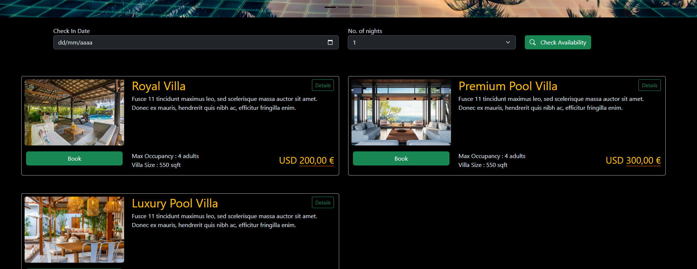

# White Lagoon

---

### Description

A simple CRUD application with three entities, built as a first hands-on project to explore Clean Architecture. The focus was on understanding and applying its core principles: separation of concerns and modularity.

### 🚀 Highlights

- 🧱 Clean Architecture structure  
- 🧩 Layered separation: domain, application, infrastructure, presentation

## Use

- Clone the repo
- Configure DB
- Build the project
- Run migrations

---

## Technologies

- .Net 7
- Entity Framework

---

## Author Info

- Linkedin - [Federico Andrés Jácome Castañeda](https://www.linkedin.com/in/federicojacome/)
- Website - [Portfolio](https://federocky.github.io/PersonalWeb/)

[Back To The Top](#MTBMalaga)
